# Group 5 Project UofT FinTech Bootcamp

__Title__: Analysis of the Impact of Bank of Canada’s actions on Canadian Banking sector through COVID-19
__Group members__: Amar Munipalle, Alexandra Hu, Nitesh Jain, Shuran Xu

## 1. Background of Covid 19 and the Economy

The COVID-19 pandemic represents a serious health threat to people around the world and a significant disruption to daily life. It is having a major impact on the global and Canadian economies. Every sector of the Canadian economy is affected. Some sectors, such as the energy, travel and hospitality, and service industries, are being particularly hard hit.

The public health actions needed to contain the spread of the virus, such as school closures, states of emergency, and social distancing measures, while necessary, are themselves going to significantly impact economic activity.

However, it’s important to underscore that while the impact is large, it will be temporary. Authorities around the world have taken bold and necessary measures to contain the spread of the virus and to support people and businesses through a very challenging time.

## 2. Covid 19 Impacts on Canada Banks

We have analysed the impact on the Big 6 Canadian Banks:

* [RBC](https://www.rbc.com/about-rbc.html)
* [BNS](https://www.scotiabank.com/ca/en/about.html)
* [BMO](https://en.wikipedia.org/wiki/Bank_of_Montreal)
* [TD](https://www.tdbank.com/aboutus/about_us.html)
* [CIBC](https://www.cibc.com/en/about-cibc.html)
* [National Bank](https://www.nbc.ca/en/about-us.html)

And 3 Smaller Canadian Banks:

* [Laurentian Bank](https://lbcfg.ca/)
* [Home Capital](https://www.homecapital.com/about-home-capital/our-story/default.aspx)
* [Canada Western Bank](https://www.cwbank.com/en/about-us)

### 2.1 Data sources and preparation

As all of those banks are public companies. We have utilized the build_portfolio() function imported from finquant api to find all their data of the timeframe from 2000.1.1 to 2020.6.30. The data are straightforward and no need to be cleaned. The returned data is in dataframe and can be directly used in plotting. 

### 2.2 Impact from Covid 19

The Canadian Banks gave large mortgage and loan books significantly impacted.
Figure plots an equally weighted index of large and small bank stocks which declines as volatility increases.

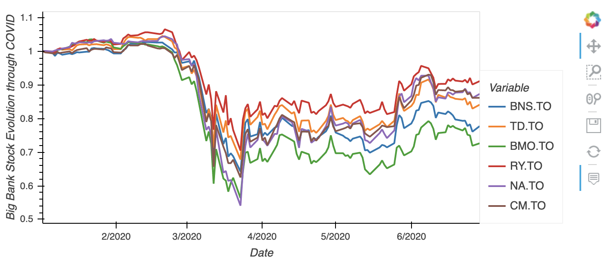

Figure 1.Price change on Big 6 Banks during Covid-19

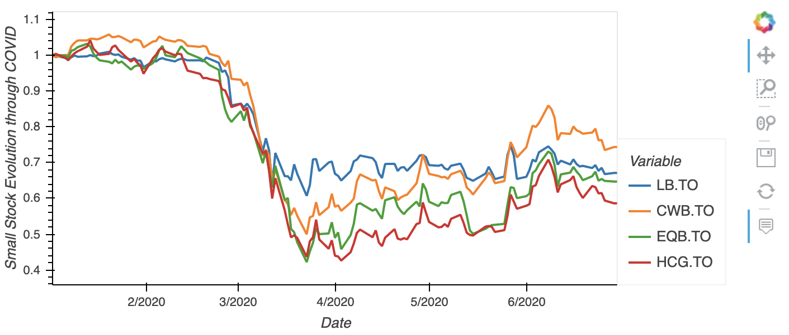

Figure 2. Price change on Four small Banks during Covid-19

### 2.3 Changes brought by Bank of Canada special programs (Ret to sec.3)

#### 2.3.1 Price Change

The efficient frontier is the set of optimal portfolios that offer the highest expected return for a defined level of risk or the lowest risk for a given level of expected return. Portfolios that lie below the efficient frontier are sub-optimal because they do not provide enough return for the level of risk.

Figure three to figure five shows the changes of efficient frontier from january, where the covid outbreak has yet arrived, to June 30th, where the programs offered by bank of canada has applied to banks. The programs offered have successfully increased the overall expected returns from the crisis and instability brought by the pandemic.

For more details, although inevitably bearing more volatilities, which increase from 0.18 to 0.2 at the frontier, the expected return has recovered to around 0.13 from 0.11 and 0.12 during the pandemic time.

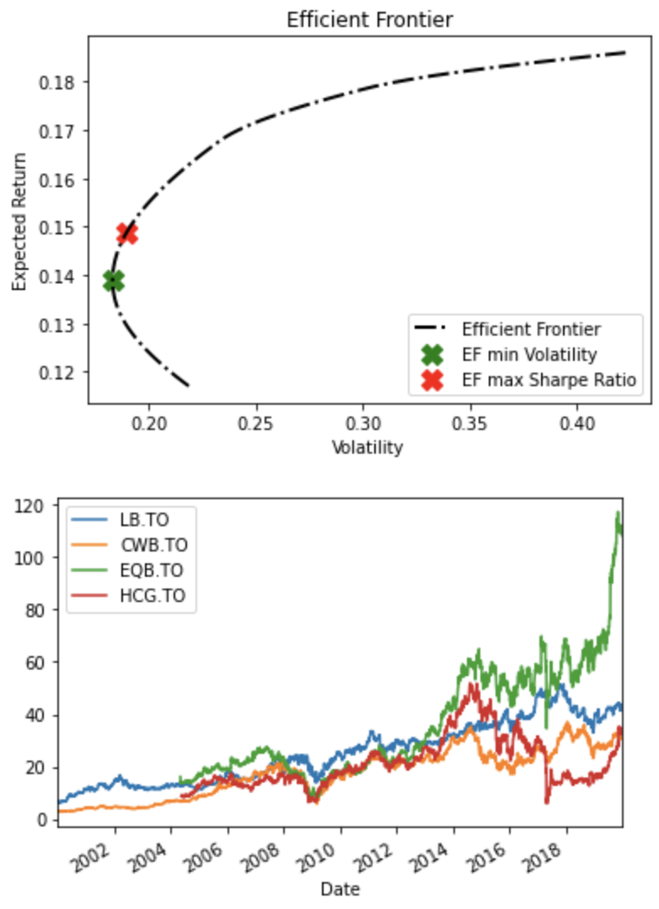

Figure 3. Efficient Frontier in January

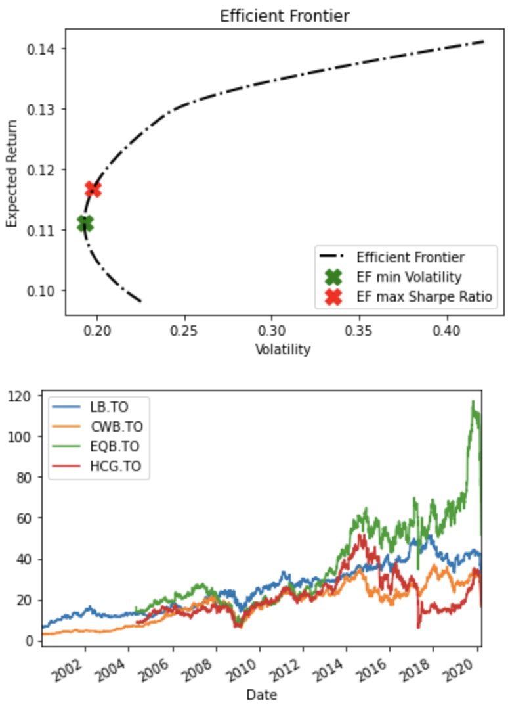

Figure 3. Efficient Frontier in March

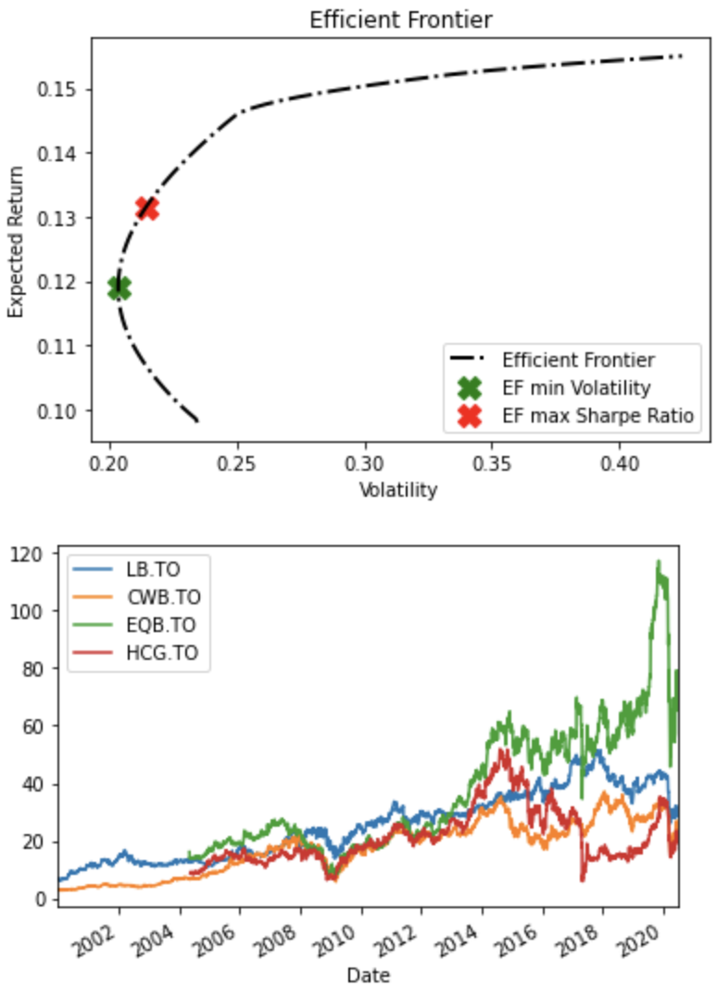

Figure 3. Efficient Frontier in June

#### 2.3.2 Monte Carlo simulation Basis on portfolio level

Monte Carlo simulation is a computerized mathematical technique that allows people to account for risk in quantitative analysis and decision making. The technique is used by professionals in such widely disparate fields as finance, project management, energy, manufacturing, engineering, research and development, insurance, oil & gas, transportation, and the environment. Monte Carlo simulation furnishes the decision-maker with a range of possible outcomes and the probabilities they will occur for any choice of action. It shows the extreme possibilities—the outcomes of going for broke and for the most conservative decision—along with all possible consequences for middle-of-the-road decisions. The technique was first used by scientists working on the atom bomb; it was named for Monte Carlo, the Monaco resort town renowned for its casinos. Since its introduction in World War II, Monte Carlo simulation has been used to model a variety of physical and conceptual systems.

We have performed a Monte Carlo run to find the portfolio with the minimum volatility and maximum Sharpe Ratio.

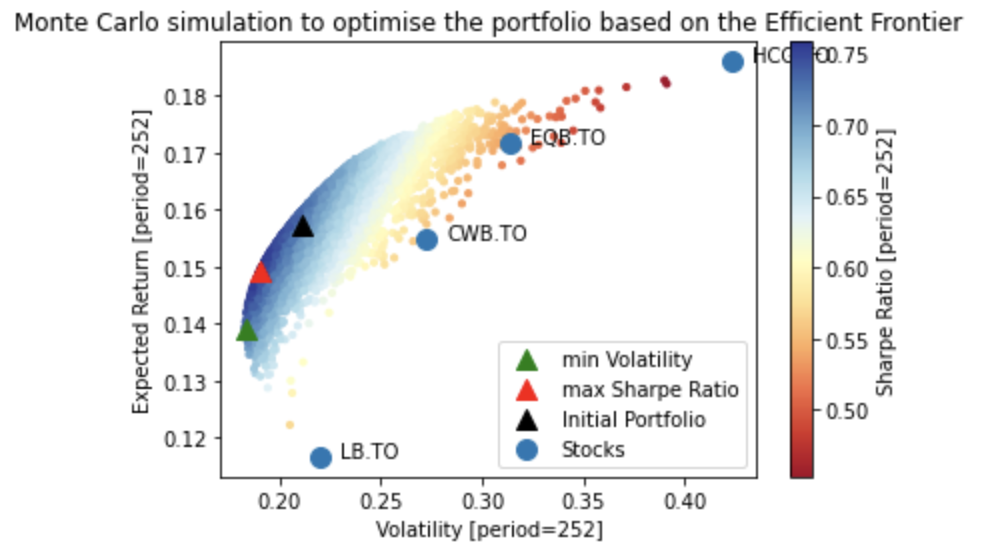

#### 2.3.3 VIX ETF portfolio

The Chicago Board Options Exchange (CBOE) has created a handy financial tool to track market volatility, known simply as Volatility Index, but better known by its acronym, the VIX. The VIX index is generated from the implied volatilities extracted from prices of index options on the S&P 500, and is intended to reflect the market's expectation of 30-day volatility.

Keeping an eye on market volatility is one thing. But investors can also benefit by trading securities that track the value of the VIX itself. Here, we consider using VIX ETFs.

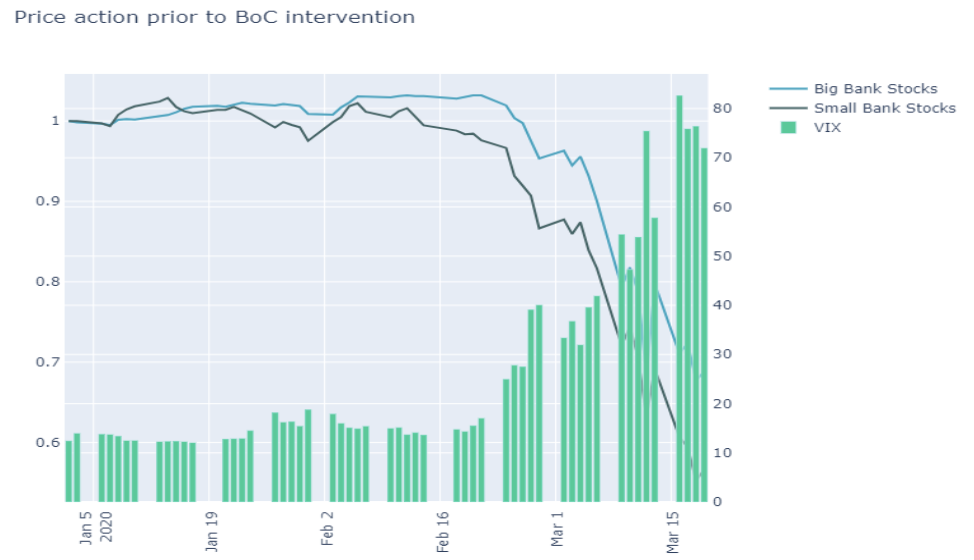

Figure 7. VIX vs Big Bank Stocks vs Small Bank Stock from Jan to March

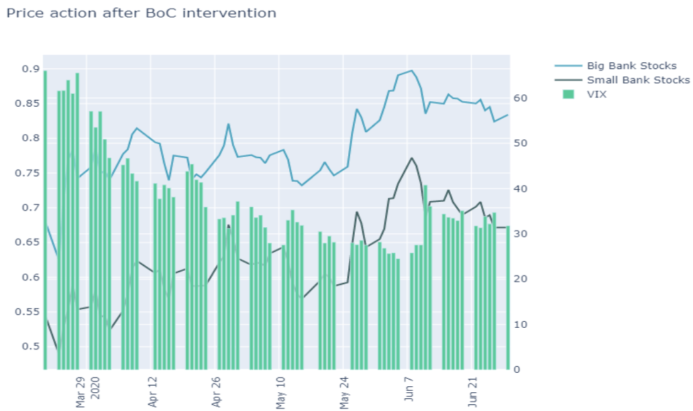

Figure 8. VIX vs Big Bank Stocks vs Small Bank Stock from March to June

## 3. Actions Taken by Bank of Canada

We are intervening to support key financial markets to ensure they continue to function properly.
In times of market turmoil, financial institutions may be reluctant to act in their normal role as market makers for bonds and other financial assets. Market makers hold inventories of securities and quote prices at which they will buy and sell—activities that may become prohibitively risky when the prices of these securities are fluctuating widely. Buyers and sellers may then find it difficult to trade—in other words, the market becomes illiquid.

This is particularly problematic in the case of friction in the market for Government of Canada bonds, which are often held as the safest Canadian-dollar asset. Those holding a bond may find it difficult to sell it to obtain cash, while those wishing to buy a bond for its safety may be unable to obtain it. Given the central role of Government of Canada bonds, including as a benchmark for other interest rates, such market illiquidity can have pervasive effects through the financial system.

### 3.1 Intervention Programs provided by Bank of Canada

As key financial markets have become strained during this period, the Bank has established several large-scale asset purchase programs to increase liquidity in core funding markets:

| Program Name | Program Description |
| ------------ | ------------------- |
| __Government of Canada Bond Purchase Program (GBPP)__ | To address strains in the Government of Canada bond market and to enhance the effectiveness of all the other actions we have taken to support core funding markets, we launched a program to purchase Government of Canada securities in the secondary market. |
| __Canada Mortgage Bond Purchase Program (CMBP)__ | Financial institutions use Canada Mortgage Bonds (CMBs) to finance their mortgage lending to Canadian homeowners. The functioning of this market was also becoming impaired amid broader market turmoil. In response, the Bank of Canada introduced a program of purchasing CMBs in the secondary market. This helps provide the means for financial institutions to renew mortgages during this period, as well as supports the flow of credit more generally. |
|  __Bankers’ Acceptance Purchase Facility (BAPF)__ | This program supports the market for bankers' acceptances, a key source of financing for small and medium-sized corporate borrowers. |
| __Provincial Money Market Purchase Program (PMMP)__ | This program is an asset purchase facility that supports a liquid and well-functioning market for short-term provincial borrowing. |
| __Provincial Bond Purchase Program (PBPP)__ | This program supplements the PMMP. The aim of both these programs is to maintain well-functioning provincial funding markets in the face of significant demands for funding as governments implement their emergency measures, and businesses and households seek to bridge this difficult period. |
| __Corporate Bond Purchase Program (CBPP)__ | This program supports the liquidity and proper functioning of the corporate debt market. A liquid and efficient market for Canadian-dollar corporate bonds allows companies, currently challenged by the impact of the COVID-19 pandemic, to continue to obtain necessary longer-dated financing to support their operations, ultimately aiding the Canadian economy. It also strengthens the pass-through of monetary policy actions to borrowers. |
| __Commercial Paper Purchase Program (CPPP)__ | This program supports the flow of credit to the economy by alleviating strains in Canada’s commercial paper markets, a key source of short-term financing to support the ongoing needs of a wide range of firms and public authorities. |
| __Contingent Term Repo Facility (CTRF)__ | This facility aims to counter severe market-wide liquidity stresses and support the stability of the Canadian financial system. It offers eligible counterparties liquidity on a standing, bilateral basis against securities issued or guaranteed by the Government of Canada or a provincial government. |
 
For this analysis we have used Government of Canada Bond Purchase Program (GBPP), Canada Mortgage Bond Purchase Program (CMBP), Bankers’ Acceptance Purchase Facility (BAPF), Provincial Bond Purchase Program (PBPP), Corporate Bond Purchase Program (CBPP), Commercial Paper Purchase Program (CPPP) and Contingent Term Repo Facility (CTRF). The rest of the program has no available public data. Besides, for comparison, we have also included the long term data of Treasury bill and Real return Bond and etc. 
 

### 3.2 Data Sources for Bank of Canada and Analysis

For the source of Bank of Canada data, We have retrieved from its own API called pyvalet, which can be import to python by the following command:

`pip install pyvalet`

The documentation for this api can be found at  [__valet_API__](https://www.bankofcanada.ca/valet/docs)

#### 3.2.1 Exploration

The Bank of Canada Valet Web Services offers programmatic access to global financial data. By using the Valet API, you can retrieve financial data and information from the Bank of Canada — such as daily exchange rates of the Canadian dollar against the European euro.

#### 3.2.2 Data Processing and Visualization

By employing the function called ValetInterpreter() from the pyvalet api, the data can be directly retrieved after checking the documentation to find the data ID in the library. For better visualization, we have renamed the data in to the program names including the following:

`
"V36612" : "Treasury Bills",  "V36613" : "Government of Canada Bonds","V1160788296" : "Real Return Bonds",  "V1038114416" : "Canada Mortgage Bonds", "v1146067261" : "Provincial Money Market", "v1154426989" : "Provincial Bonds",   "v1146067262" : "Bankers Acceptance", "v1146067263" : "Commercial Paper",  "v1154426990" : "Corporate Bonds",  "V44201362" : "Securities Purchased under Resale Agreement", "V36610" : "Total Assets"
`

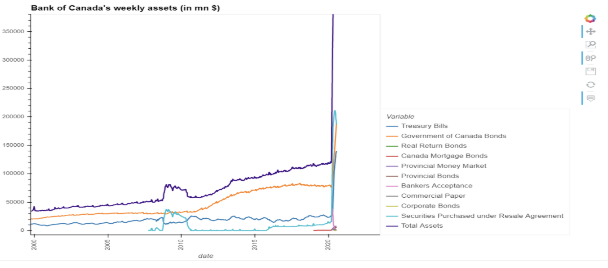

Figure 9. Bank of Canada Weekly Assets

The function of the 8 programs offered by Bank of Canada is to ease the liquidity and promise all banks can operate normally. 

__*Note*__:Liquidity refers to the ease with which an asset, or security, can be converted into ready cash without affecting its market price. Cash is the most liquid of assets while tangible items are less liquid and the two main types of liquidity include market liquidity and accounting liquidity.

## 4. Overall Stock Market

### 4.1 Data Sources and Preparation

We have retrieved the market data utilising alpaca-trade-api. After loading the environment variable and finishing setting up alpaca-trade-api, we have retrieved assets which are as long as available in the market. The data includes open price, highest price during the day, lowest price during the day, closing price and trading volume. For that we only care for the closing prices, we have dropped the rest of the columns, and reset the index by date-time.

### 4.2 Visual Presentation

We have run the price trajectory simulation for next year for 1000 times considering 252 days trading per year. Monte Carlo simulation on crisis peak with a 81 day horizon to compare with ‘today’s’ prices.

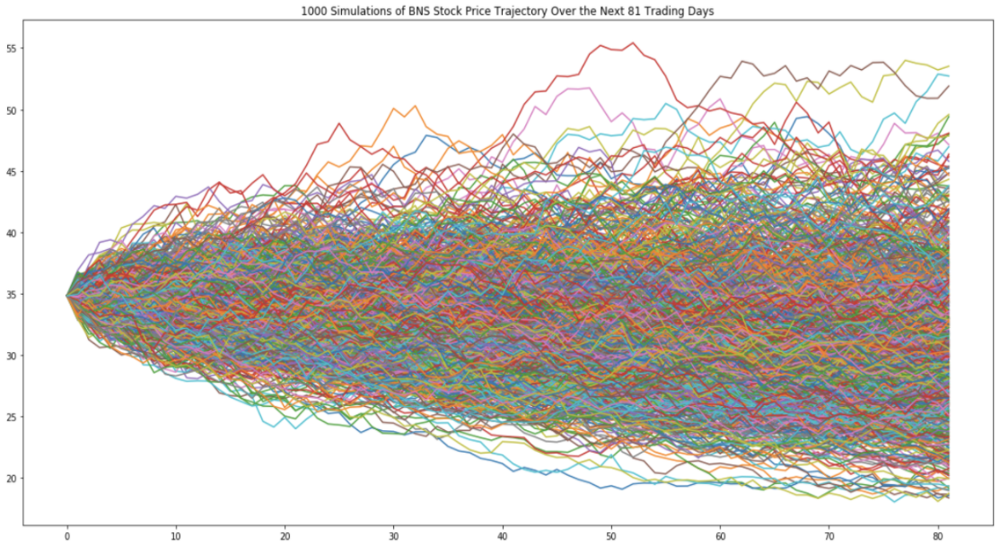

Figure 10. Price trajectory simulation

### 4.3 Confidence interval

We have compared actual prices on July 20 with a Monte Carlo simulation generated at the peak of the crisis. It validates that actual prices are beyond the 95% tile establishing statistical significance of interventions.

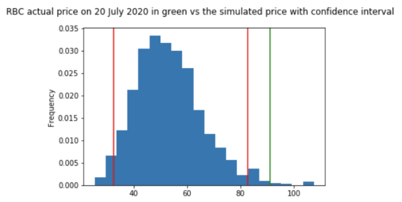

Figure 11. RBC vs Price simulated with confidence interval

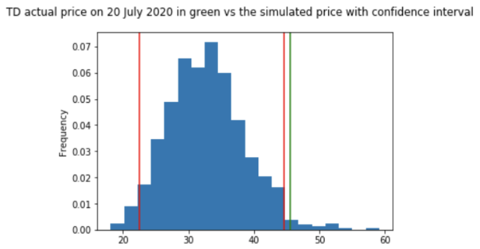

Figure 12. TD vs Price simulated with confidence interval

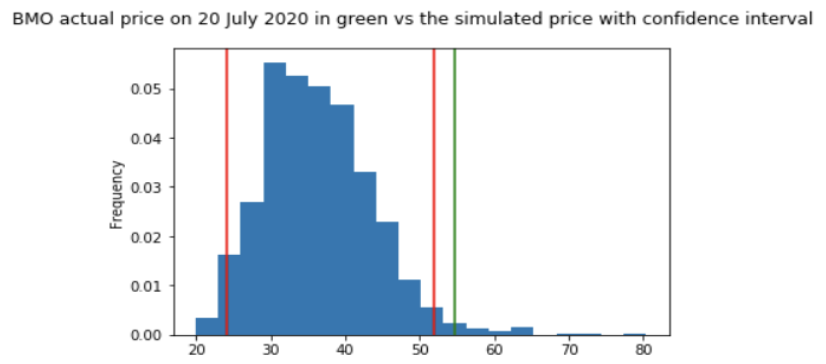

Figure 13. BMO vs Price simulated with confidence interval

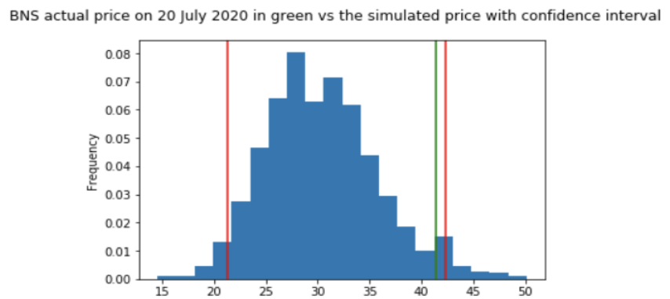

Figure 14. BNS vs Price simulated with confidence interval

